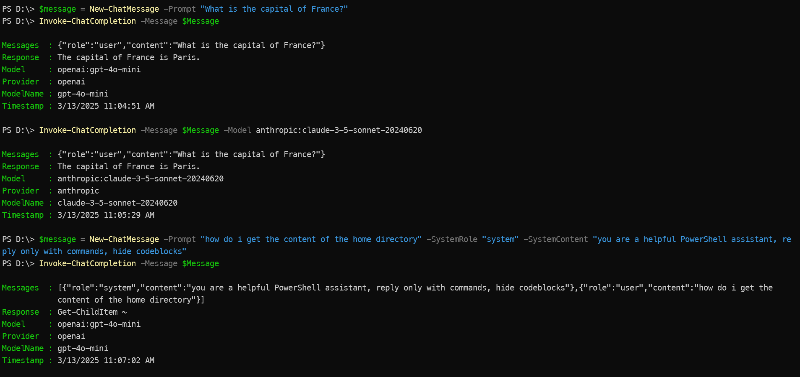

# PSAISuite

Simple, unified interface to multiple Generative AI providers.

`PSAISuite` makes it easy for developers to use multiple LLM through a standardized interface. Using an interface similar to OpenAI's, `PSAISuite` makes it easy to interact with the most popular LLMs and compare the results. It is a thin wrapper around the LLM endpoint, and allows creators to seamlessly swap out and test responses from different LLM providers without changing their code. Today, the library is primarily focussed on chat completions. I will expand it cover more use cases in near future.

Currently supported providers are:

- [Anthropic](guides/antrhopic.md)
- [Azure AI Foundry](guides/azureai.md)
- [DeepSeek](guides/deepseek.md)
- [Google](guides/google.md)
- [Groq](guides/groq.md)
- [Mistral](guides/mistral.md)
- [Nebius](guides/nebius.md)
- [Ollama](guides/ollama.md)
- [OpenAI](guides/openai.md)
- [Perplexity](guides/perplexity.md)
- [xAI](guides/xai.md)

## In Action



## Installation
You can install the module from the PowerShell Gallery.

```powershell
Install-Module PSAISuite
```

## Setup
To get started, you will need API Keys for the providers you intend to use.

The API Keys need to be be set as environment variables.

Set the API keys.

```powershell
$env:OpenAIKey="your-openai-api-key"
$env:AnthropicKey="your-anthropic-api-key"
$env:NebiusKey="your-nebius-api-key"
# ... and so on for other providers
```

### Azure AI Foundry

You will need to set the `AzureAIKey` and `AzureAIEndpoint` environment variables.

```powershell
$env:AzureAIKey = "your-azure-ai-key"
$env:AzureAIEndpoint = "your-azure-ai-endpoint"
```

## Usage

Using `PSAISuite` to generate chat completion responses from different providers.

### List Available Providers

You can list all available AI providers using the `Get-ChatProviders` function:

```powershell
# Get a list of all available providers
Get-ChatProviders
```

### Generate Chat Completions

```powershell
# Import the module
Import-Module PSAISuite

$models = @("openai:gpt-4o", "anthropic:claude-3-5-sonnet-20240620", "azureai:gpt-4o", "nebius:meta-llama/Llama-3.3-70B-Instruct")

$message = New-ChatMessage -Prompt "What is the capital of France?"

foreach($model in $models) {
    Invoke-ChatCompletion -Message $message -Model $model
}
```

Note that the model name in the Invoke-ChatCompletion call uses the format - `<provider>:<model-name>`.

## Adding support for a provider

documentation coming soon